# Moolah

A self-hosted personal-finance, budgeting & net-worth tracker.
Log income and expenses on a **monthly calendar** with a running **projected cash balance**, link your banks with **Plaid** for automatic transaction sync, budget by
category, set **savings goals**, plan your **debt payoff**, and watch your **net worth** and
**trends** evolve over time. Your data lives in your own database, on your own machine.

Built with **Next.js 16 (App Router) · TypeScript · Prisma 7 · PostgreSQL · Auth.js v5 · Plaid · Tailwind v4 · Recharts**.

[](https://github.com/vinnymicale/moolah/actions/workflows/ci.yml)
[](https://buymeacoffee.com/vinnymicale)

**[Try the live demo →](https://moolah-five.vercel.app)** - no sign-up; it serves a seeded sample
dataset, and anything you change stays in your browser only.

> **AI disclaimer:** Moolah was built with help from AI (Anthropic's Claude). Treat it
> accordingly - review the code yourself before trusting it with sensitive financial data, and note
> that it comes with no warranty (see [Disclaimer](#disclaimer)).

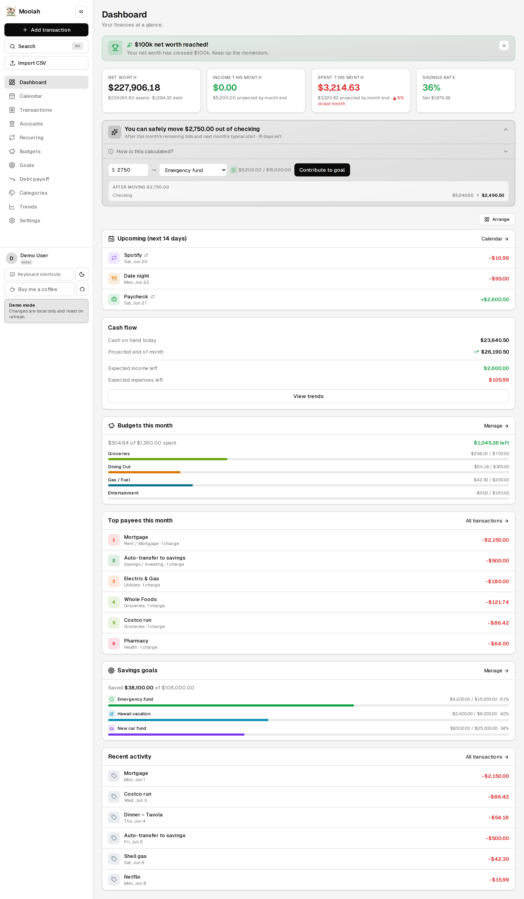

> The dashboard, showing net-worth milestones, the safe-to-transfer suggestion, spending alerts,
> top payees, budgets, and recent activity. _(Sample data for illustration.)_

---

## Roadmap

Planned improvements, roughly in priority order:

- **Household / multi-user support** *(in progress)* - share one dataset with a partner: invite
  codes, per-member attribution on transactions, and a shared calendar. Local name+password
  accounts with per-user data and Plaid keys already landed; the shared-household layer is next.

Recently shipped: [Docker support](#self-hosting-with-docker), the [read-only data
API](#read-only-data-api), category splits (one charge across multiple categories), and
[in-app backup restore](#backing-up-your-data-and-your-plaid-connections) (upload a full backup
from Settings, not just the CLI).

Have a request? Open an issue on GitHub.

---

## Features

### Money in & out
- **Monthly calendar** - each day shows its income/expense events and a projected end-of-day
  cash balance that accounts for upcoming/expected and recurring transactions, with low-balance
  warnings. Days with many events expand into a full day view.
- **Recurring transactions** - paychecks, rent, subscriptions; projected onto future days and
  "marked paid" when they actually happen. Plaid sync smart-matches real charges to recurring
  rules so projections don't double-count.
- **Plaid bank integration** - securely link checking, savings, and credit-card accounts; balances
  and posted transactions sync automatically and are auto-categorised using the bank's own
  category data (with a one-click "fix categories" re-run). If a bank connection breaks, a
  **Reconnect** button re-authenticates it in place - same Plaid item, so no new billed connection.
- **Auto-categorization rules** - "description contains *costco* → Groceries". Your rules run on
  every bank sync and CSV import (beating the generic mappers), and a one-click backfill
  categorizes existing uncategorized history. Managed on the Categories page.
- **Transfer matching** - credit-card payments are detected automatically (the checking debit and
  the card credit are linked as a pair) and excluded from income/spending totals, so paying your
  card never counts as "spending" twice. Pairs can also be linked/unlinked by hand.
- **Split transactions** - attribute one charge to multiple categories (a Costco run that's part
  groceries, part household). Budgets, trends, and spending alerts count each split part under its
  own category, while the charge still totals once.
- **CSV import** - drag-and-drop a bank CSV anywhere to review and import transactions.

### Planning
- **Budgets** - set monthly limits per category and track spent-vs-remaining, on the dashboard
  and in trends.
- **Savings goals** - track progress toward targets (emergency fund, vacation, down payment) with
  contributions and target dates.
- **Debt payoff planner** - model **avalanche** (highest APR first) or **snowball** (smallest
  balance first) strategies, add an extra monthly payment, and see your debt-free date, total
  interest, interest saved vs. minimums, a balance-over-time chart, and per-debt payoff order.
- **Safe-to-transfer suggestion** - the dashboard estimates how much you can safely move out of
  checking this month after remaining bills and a history-based buffer for next month's typical
  early-month spending.

### Accounts & insight
- **Accounts & net worth** - assets vs. liabilities with a live net-worth total; manual balance
  snapshots build net-worth history (great for retirement, vehicle, or property values). Any
  account can be **excluded from net worth** while still being tracked (e.g. student loans).
- **Trends** - net worth over time, income vs. expenses, spending by category, budget vs. actual,
  and a category month-over-month comparison table.
- **Dashboard** - net worth, monthly income/spend, savings rate, upcoming bills, recent activity,
  spending alerts (categories trending over their 3-month average), top payees, and net-worth
  milestone celebrations. Cards are drag-to-reorder.
- **AI assistant (optional)** - bring your own Anthropic, OpenAI, or Gemini API key (Settings) and
  chat with your finances: "how much did I spend on dining out last month?", "add a $15.99/month
  Netflix expense", "set a $500 grocery budget". The key is encrypted at rest and never sent to
  the browser.

### Finding & exporting
- **Global search (⌘K)** - a command palette to search your entire transaction history by name,
  note, or amount from anywhere, with keyboard navigation.
- **Powerful filtering** - multi-select filters (type, status, categories, accounts), custom date
  ranges, and named **saved filters** on the Transactions page.
- **Data export** - download your full transaction history as CSV, filtered by date, account, or
  category, from Settings.
- **Full backup & restore** - download a single JSON snapshot of everything (every table, including
  your Plaid access tokens) and restore it later - both from the CLI and directly in **Settings**.
  Restoring re-uses your existing Plaid connections, so moving to a new machine or Docker host
  costs no new billed bank links.

### Polished
- **Extras** - dark mode, mobile-friendly, keyboard shortcuts, an email allow-list, and dates that
  follow **your timezone** (not the server's). Recurrence / projection / debt-payoff / matching
  math is unit-tested, with a Playwright e2e suite and CI on every push and PR.

---

## Screenshots

A tour of every page. _(Sample data - generated from the isolated `demo@example.com` account.)_

### Money in & out

**Monthly calendar** - each day shows its income/expense events and a projected end-of-day cash balance.
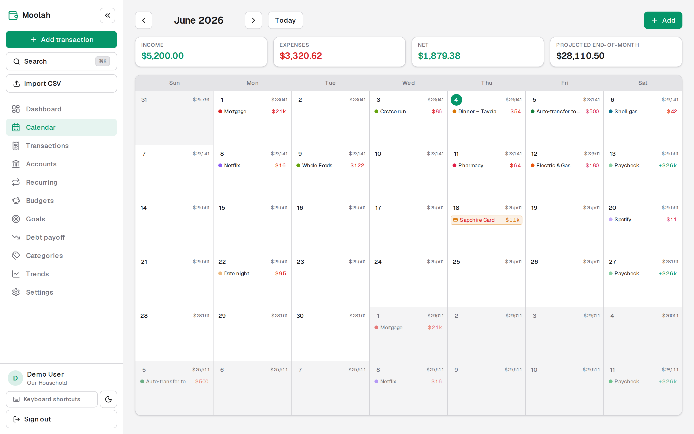

**Transactions** - search, multi-select filters (type, status, category, account), date ranges, and CSV export.
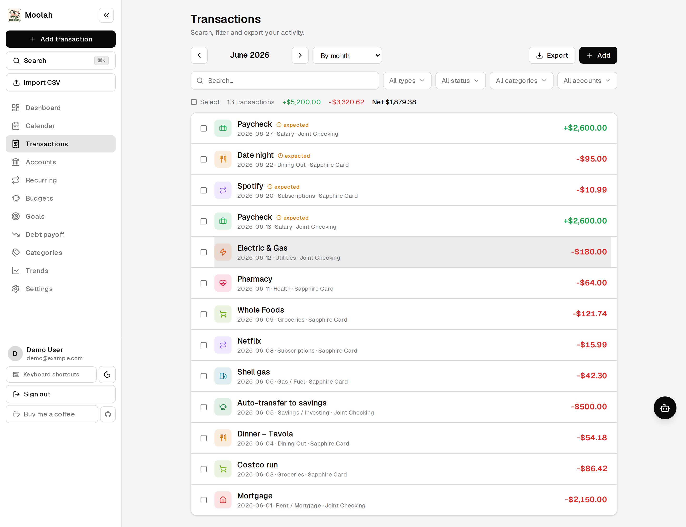

**Recurring** - paychecks, bills, and subscriptions that repeat automatically on the calendar.
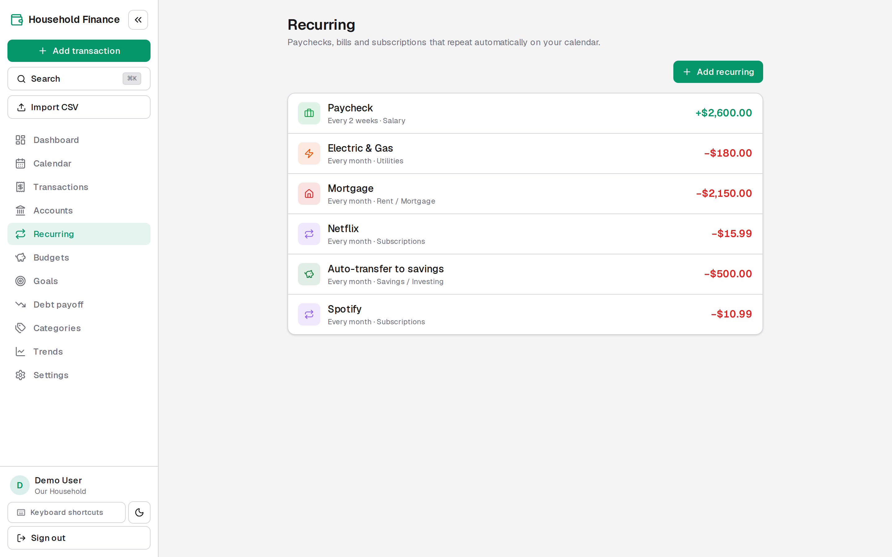

### Planning

**Budgets** - set a monthly limit per category and track spent-vs-remaining, with copy-from-last-month.
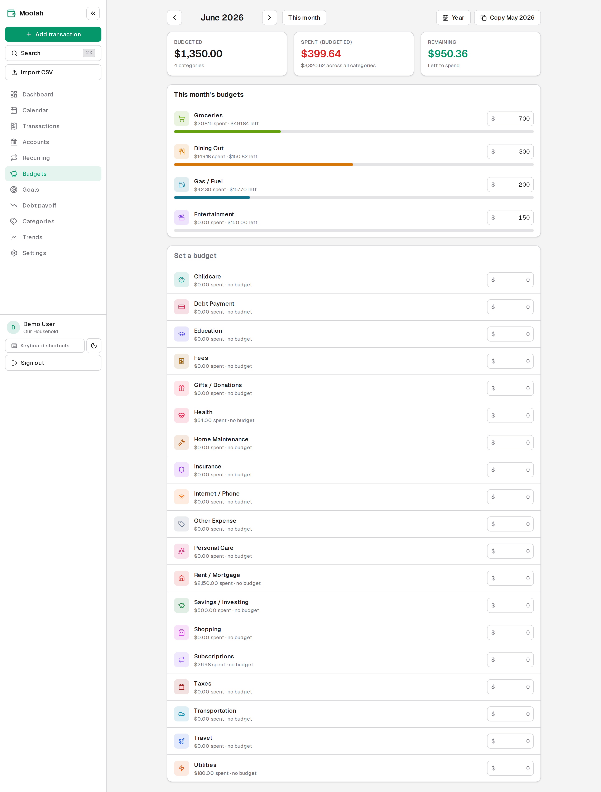

**Savings goals** - track progress toward targets (emergency fund, vacation, down payment) with contributions and target dates.
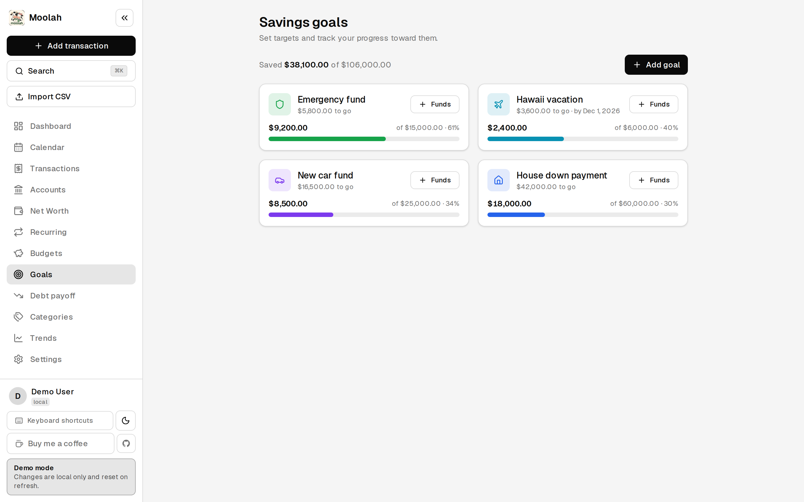

**Debt payoff** - model **avalanche** or **snowball**, add an extra payment, and see your debt-free date, total interest, a balance-over-time chart, and per-debt payoff order.
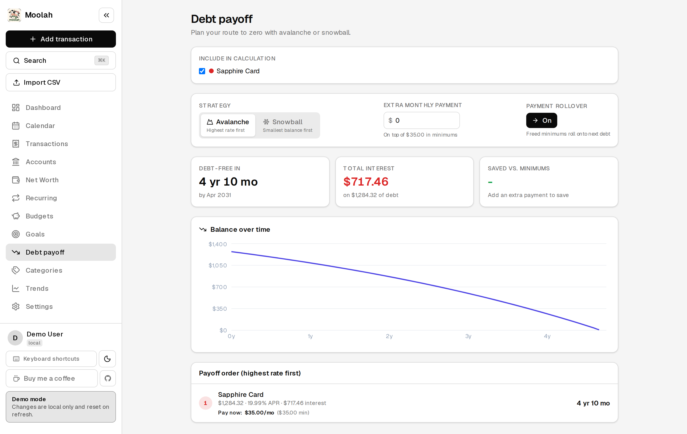

### Accounts & insight

**Accounts & net worth** - assets vs. liabilities with a live net-worth total and per-account balance history.
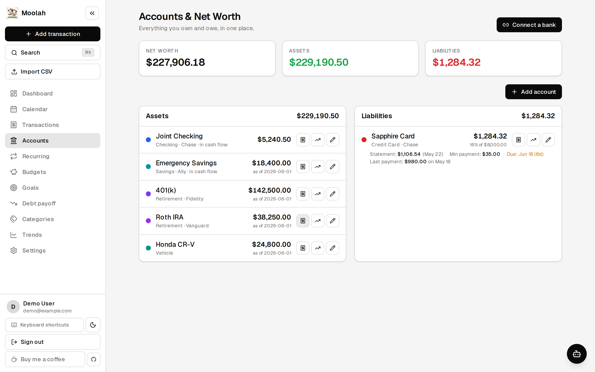

**Trends** - net worth over time, income vs. expenses, spending by category, budget vs. actual, and month-over-month comparison.
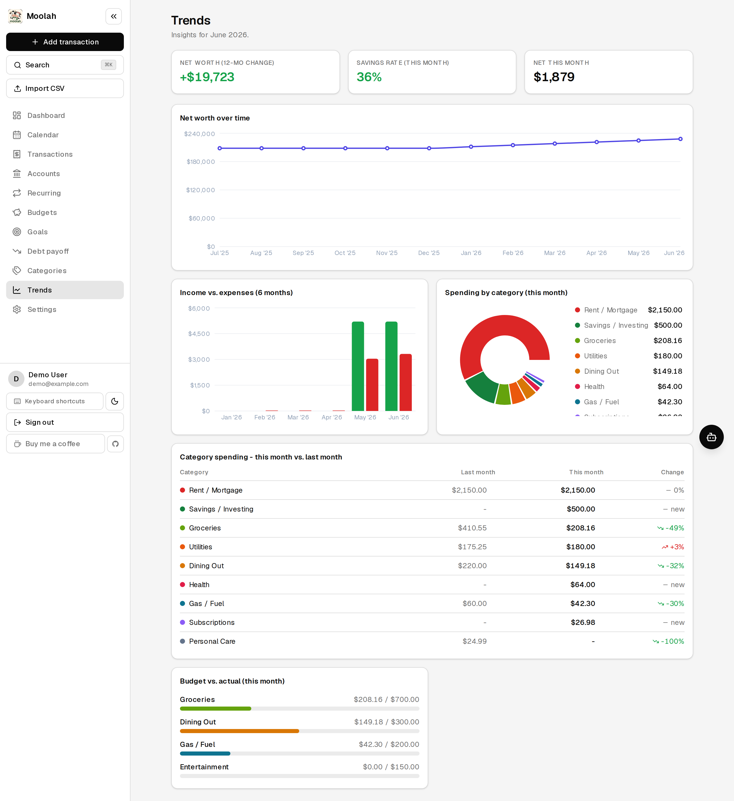

### Dark mode

A built-in **dark theme** (toggle in the sidebar) carries across every page.
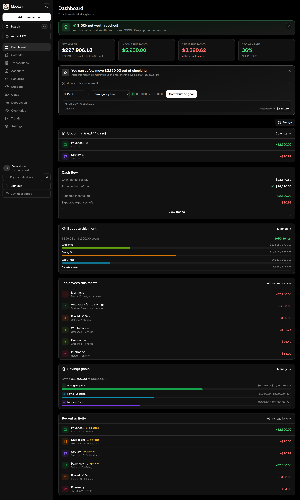

### Setup & organization

**Categories** - organize how you classify income and spending, each with its own icon and color.
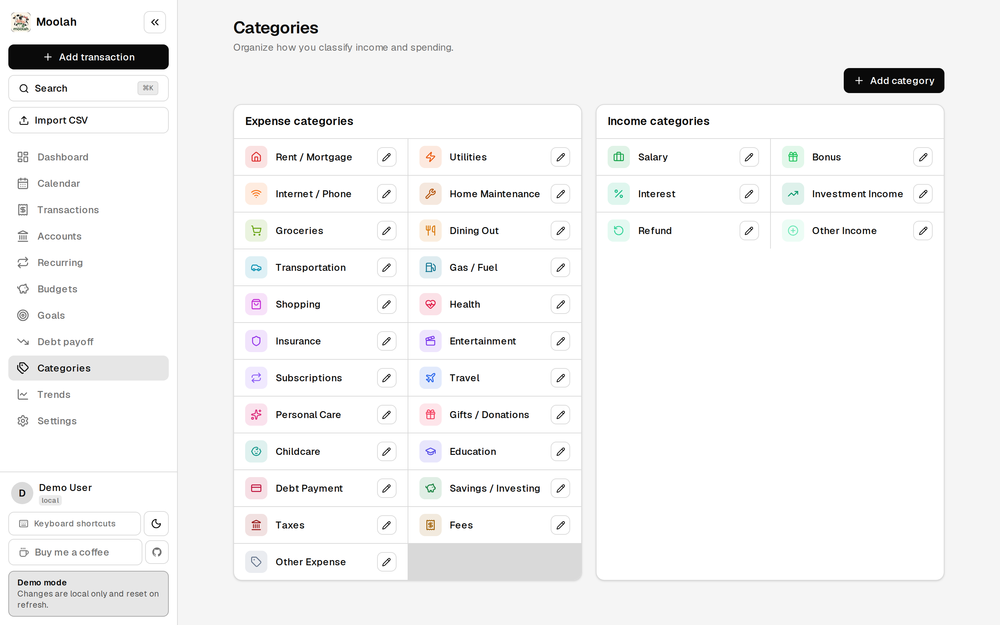

**Settings** - export data as CSV, download or restore a full backup, generate a read-only API token, manage Plaid keys, and connect the AI assistant.
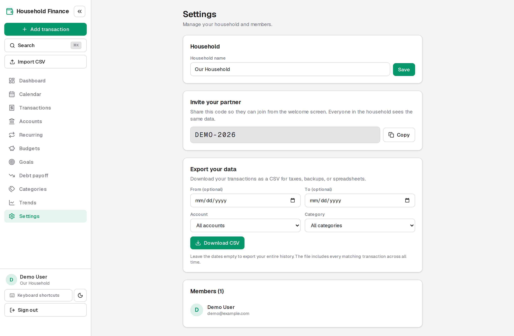

**Sign in** - simple name + password accounts, stored entirely in your own database.

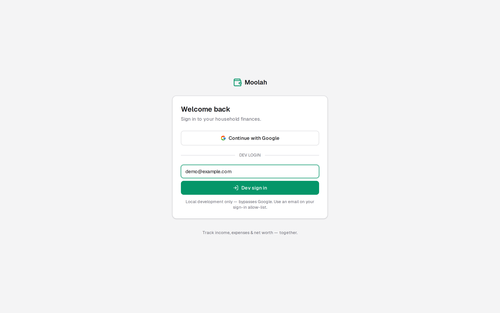

---

## Quick start (local, zero cloud setup)

You need **Node 20.9+** (the minimum for Next.js 16). No Docker or system Postgres required - a real
Postgres is downloaded and run for you by
[`embedded-postgres`](https://www.npmjs.com/package/embedded-postgres).

```bash
npm install
cp .env.example .env       # the defaults already work for local dev
npm run setup              # download the bundled DB (first run) & create the schema
npm run start:all          # run the database and web app together
```

`npm run start:all` runs the bundled Postgres **and** the Next.js dev server side by side (via
`concurrently`), so you only need one terminal. Open <http://localhost:3000>.

With the shipped defaults (`AUTH_BYPASS="true"`) you're **signed in automatically** as a local
user - no password or sign-in screen - so you can start adding transactions right away. Set
`AUTH_BYPASS="false"` when you want a real password-protected login.

> **Heads up:** the web app needs the database running. Use `npm run start:all` (DB + web) rather
> than `npm run dev` alone, or the app will fail to reach Postgres.

### Want to explore with sample data first?

Load an isolated demo dataset full of example accounts, transactions, budgets and goals:

```bash
npm run setup -- --seed    # create the schema *and* the demo data
```

Then, to browse that demo data, set `DEMO_MODE="true"` (with `AUTH_BYPASS="true"`) in `.env` and
relaunch - no sign-in needed. The demo seed is fully isolated: it only ever touches the throwaway
`demo@example.com` account and never modifies your own data.

Useful scripts:

| Script | What it does |
| --- | --- |
| `npm run setup` | First-run: create the schema (add `-- --seed` for demo data) |
| `npm run start:all` | Run the bundled Postgres **and** the app together |
| `npm run dev` | Start just the app (assumes the DB is already running) |
| `npm run db:local` | Run the bundled local Postgres on port 5433 |
| `npm run db:push` | Sync the Prisma schema to the database |
| `npm run db:seed` | Load/refresh the isolated demo data |
| `npm run db:studio` | Browse the database in Prisma Studio |
| `npm run test` | Run the unit tests (recurrence, projection, debt-payoff, matching) |
| `npm run test:e2e` | Run the Playwright end-to-end suite against a production build |
| `npm run build` | Production build |

---

## Self-hosting with Docker

For a deploy that runs like any other self-hosted service (Unraid, a NAS, a VPS), use the bundled
image and compose file - the app and its own Postgres, no Node toolchain on the host.

```bash
cp .env.docker.example .env     # then edit .env
npx auth secret                 # generate a value for AUTH_SECRET in .env
docker compose up -d --build
```

Open <http://localhost:3000> (or whatever `APP_PORT` you set). On start the container waits for
Postgres, applies any pending database migrations automatically, then serves the app. Data lives in
the `moolah-db` Docker volume, so it survives restarts and image rebuilds.

The image is a multi-stage build producing Next.js [standalone](https://nextjs.org/docs/app/api-reference/config/next-config-js/output)
output and runs as a non-root user. To update: `git pull && docker compose up -d --build`.

---

## Read-only data API

Moolah exposes versioned, read-only `/api/v1` endpoints so external tools - e.g. a **Home
Assistant** dashboard on your network - can pull your numbers. Generate a personal token under
**Settings → Read-only API access** (shown once; only its hash is stored), then send it as a bearer
token:

```bash
curl -H "Authorization: Bearer moolah_…" http://localhost:3000/api/v1/summary
```

| Endpoint | Returns |
| --- | --- |
| `GET /api/v1/summary` | Net worth, safe-to-transfer, current-month budget status, upcoming bills |
| `GET /api/v1/net-worth` | Assets, liabilities, net, and per-account balances |
| `GET /api/v1/accounts` | All non-archived accounts with balances |
| `GET /api/v1/budget` | Budget vs. actual per category (`?month=YYYY-MM` optional) |
| `GET /api/v1/upcoming` | Bills/income in the next N days (`?days=14`, 1-90) |

Pass `?tz=America/New_York` to anchor "today"/"this month" to your timezone (defaults to UTC).
Requests are rate-limited per token. Regenerating or revoking the token in Settings immediately
invalidates the old one.

### Home Assistant

Two ways to surface these numbers in Home Assistant:

- **Dedicated integration** (`hass-moolah`) - a companion custom component (HACS-style) that you
  point at your Moolah URL and paste the read-only token into during setup. It polls `/api/v1` and
  exposes sensors for net worth, assets, liabilities, safe-to-transfer, budget limit/spent/remaining,
  and upcoming bills - ready to drop onto a dashboard.
- **No-integration option** - a built-in [RESTful
  sensor](https://www.home-assistant.io/integrations/sensor.rest/) polling `/api/v1/summary` with
  the bearer token works without installing anything.

---

## Sharing it with others (testers / collaborators)

Each person runs their **own local copy** - there's no shared server, so everyone's data stays
separate. To let someone test it:

1. Add them as a **collaborator** on the repo (GitHub → **Settings → Collaborators**).
2. They clone it and follow the **Quick start** above. With the shipped `.env.example`
   (`AUTH_BYPASS="true"`), they're signed straight into their own empty copy - no credentials
   needed to look around.
3. To use it for real, set `AUTH_BYPASS="false"` - the sign-in screen shows a name + password
   form to create their account. For bank sync, they paste their own Plaid keys into
   **Settings → Plaid bank sync** after signing in (stored per-user, secret encrypted).

---

## Desktop launcher (Windows + WSL, optional)

`scripts/launch.sh` runs Moolah like a desktop app. One launch: it starts the database + production
server, **applies pending migrations**, writes a **throttled automatic backup** (skips if one was
made in the last 12h; keeps the 10 most recent), **rebuilds only if the source changed**, opens
Moolah in a dedicated browser **app window**, and - when you close that window - shuts the whole
stack down cleanly (`scripts/stop.sh` also does this, with a port-based safety net).

On the maintainer's machine it's wired to a single **Moolah** desktop shortcut: a hidden `.vbs` that
runs `wsl.exe … bash scripts/launch.sh`, opening an Edge `--app` window. The paths inside the
scripts/shortcut are machine-specific - adapt them for your own setup.

## Connecting banks with Plaid (optional)

Create a free account at the [Plaid Dashboard](https://dashboard.plaid.com/), grab your keys from
**Developers → Keys**, and paste them into **Settings → Plaid bank sync** - they're stored
per-user (secret encrypted) so each account can use its own Plaid credentials. Alternatively, set
them in `.env` as an instance-wide fallback for users without their own keys:

```env
PLAID_CLIENT_ID="..."
PLAID_SECRET="..."           # use the secret that matches PLAID_ENV
PLAID_ENV="sandbox"          # "sandbox" = fake test data; "production" = your real banks
```

- **`sandbox`** lets you link Plaid's test institutions (use credentials like `user_good` /
  `pass_good`) with fake data - perfect for trying everything out at no cost.
- **`production`** connects your **real** banks. It requires requesting production access in the
  Plaid Dashboard, and Plaid **bills you per linked item (bank connection)** - so avoid
  re-linking the same bank (see [Backing up your data](#backing-up-your-data-and-your-plaid-connections)).
- Plaid's old **`development`** environment has been retired and is no longer an option.

Once set, use **Connect a bank** on the Accounts page; balances and posted transactions sync
automatically and are auto-categorised from the bank's category data. Linking is optional - manual
and CSV entry work without Plaid.

---

## Backing up your data (and your Plaid connections)

When you run locally, **everything lives in one place**: the Postgres data directory `.pgdata/` in
the project root. That includes your accounts, transactions, budgets, goals - **and your Plaid
access tokens** (stored in the `PlaidItem.accessToken` column). If you lose `.pgdata/`, you have to
re-link every bank, and on the **production** Plaid environment each re-link is a fresh, *billed*
connection. So if you connect real banks, back this up.

**The reassuring part:** a Plaid access token is tied to your `PLAID_CLIENT_ID` + `PLAID_SECRET` +
`PLAID_ENV` - **not** to this computer or database. You can copy the token data to another machine
(or a future packaged build) and keep using the same connections. **Restoring a saved token never
costs a new Plaid item - only clicking "Connect a bank" does.**

### Option A - one-command backup (recommended)

Export everything to a single JSON file (all tables, including the Plaid tokens):

```bash
npm run db:backup          # writes backups/moolah-backup-<timestamp>.json
```

Or, in the running app, go to **Settings → Back up everything → Download backup** to get the same
file in your browser. Copy it somewhere safe (external drive / cloud folder).

**To restore in the app:** go to **Settings → Restore from a backup**, pick a backup file, and
confirm. This overwrites the current database with the backup's contents, so you're signed out
afterward and log back in with the restored account. Ideal for the export → spin up Docker →
import-without-reconfiguring workflow.

**To restore from the CLI** (e.g. into a fresh clone):

```bash
npm install
npm run db:local           # start the bundled Postgres
npm run db:push            # create the (empty) schema
npm run db:restore -- ./path/to/moolah-backup-<timestamp>.json
```

Your banks reconnect with **no new Plaid items** and no re-linking. (`db:restore` only writes into an
empty database; pass `--force` to overwrite an existing one - the in-app restore always overwrites.)
The `backups/` folder is gitignored.

### Option B - raw data-directory copy

For a full cold copy you can also just back up the database folder itself:

1. **Stop the app** (so Postgres isn't writing mid-copy).
2. Copy the **`.pgdata/`** directory and your **`.env`** file somewhere safe.
3. **To restore**, drop both back into place. **If the backup was copied through Windows** (e.g. a
   OneDrive/Desktop folder, common with WSL), `.pgdata/` comes back world-readable and Postgres
   refuses to start with a *"data directory has invalid permissions"* error. Fix it once:
   ```bash
   chmod 700 .pgdata             # Postgres requires the data dir to be 0700 (or 0750)
   rm -f .pgdata/postmaster.pid  # clear any stale lockfile copied from a running server
   ```
   Then start the app. (Option A avoids this entirely, since it restores into a fresh `.pgdata`.)

> ⚠️ Treat any backup as a secret - the Plaid access tokens are stored **unencrypted** and grant
> access to your bank data. Keep them somewhere private.

> Never run `npm run db:reset` or delete `.pgdata/` without a current backup - both wipe your tokens.

---

## How the cash projection works

Each cash account (checking/savings/cash flagged "include in cash flow") has a `currentBalance`
that's treated as the truth **as of today**. For any calendar day the projected end-of-day balance
is `todayBalance + (cumulative signed transactions up to that day - cumulative up to today)`, where
income is `+` and expense is `-`. This single formula reconstructs past days and projects future
ones - including not-yet-cleared and recurring items. The logic lives in
[`src/lib/projection.ts`](src/lib/projection.ts) and [`src/lib/recurrence.ts`](src/lib/recurrence.ts)
and is covered by unit tests.

> Note: recording transactions does **not** auto-mutate an account's `currentBalance`. Update real
> balances via **Update balance** on the Accounts page (which also builds net-worth history), or
> let Plaid sync keep linked balances current. This keeps reconciled balances and the projected
> ledger cleanly separated.

---

## Project structure

```
prisma/            schema.prisma, migrations, seed.ts
scripts/           setup.ts (first-run schema), local-db.ts (embedded Postgres runner)
src/
  app/(auth)/      sign-in
  app/(app)/       dashboard, calendar, transactions, accounts, recurring,
                   budgets, goals, debt, categories, trends, settings
  app/api/         plaid (link/exchange/sync/recategorize), export (CSV),
                   backup (download/import), v1 (read-only API), chat (AI assistant), health
  actions/         server actions (mutations)
  lib/             prisma, auth/session, money, dates, recurrence, projection,
                   calendar, reports, queries, plaid-sync, debt-payoff, milestones,
                   backup (full export/restore), crypto (secret encryption), api-auth (token auth)
  components/      AppChrome, CommandPalette, MultiSelect, TransactionModal,
                   Modal, charts, icons
```

---

## Support

Moolah is free and self-hosted. If you find it useful and want to support its development, you can
[**buy me a coffee** ☕](https://buymeacoffee.com/vinnymicale) - entirely optional, and always
appreciated.

---

## Disclaimer

Moolah was developed with assistance from AI (Anthropic's Claude). It is a personal
project provided **as-is, without warranty of any kind**, express or implied. You run it at your own
risk: review the code before trusting it with real financial data, keep your own backups, and
remember that anything it shows you (projections, "safe to transfer", debt payoff, net worth) is for
informational purposes only and is **not financial advice**. You are responsible for the security of
your own deployment, credentials, and Plaid access tokens.

Moolah is released under the [MIT License](LICENSE) - you're free to use, modify, and self-host it.
