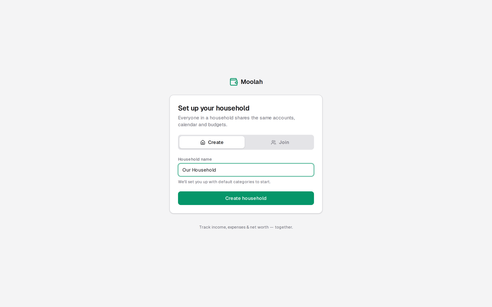

# Moolah

A shared personal-finance, budgeting & net-worth tracker for two people (you and your partner).
Log income and expenses on a **monthly calendar** with a running **projected cash balance**, link your banks with **Plaid** for automatic transaction sync, budget by
category, set **savings goals**, plan your **debt payoff**, and watch your **net worth** and
**trends** evolve over time. Both of you sign in with Google and share one unified dataset.

Built with **Next.js 16 (App Router) · TypeScript · Prisma 7 · PostgreSQL · Auth.js v5 · Plaid · Tailwind v4 · Recharts**.

[](https://buymeacoffee.com/vinnymicale)

> **AI disclaimer:** Moolah was built with help from AI (Anthropic's Claude). Treat it
> accordingly — review the code yourself before trusting it with sensitive financial data, and note
> that it comes with no warranty (see [Disclaimer](#disclaimer)).


> The dashboard, showing net-worth milestones, the safe-to-transfer suggestion, spending alerts,
> top payees, budgets, and recent activity. _(Sample data for illustration.)_

---

## Features

### Money in & out
- **Monthly calendar** — each day shows its income/expense events and a projected end-of-day
  cash balance that accounts for upcoming/expected and recurring transactions, with low-balance
  warnings. Days with many events expand into a full day view.
- **Recurring transactions** — paychecks, rent, subscriptions; projected onto future days and
  "marked paid" when they actually happen. Plaid sync smart-matches real charges to recurring
  rules so projections don't double-count.
- **Plaid bank integration** — securely link checking, savings, and credit-card accounts; balances
  and posted transactions sync automatically and are auto-categorised using the bank's own
  category data (with a one-click "fix categories" re-run).
- **CSV import** — drag-and-drop a bank CSV anywhere to review and import transactions.

### Planning
- **Budgets** — set monthly limits per category and track spent-vs-remaining, on the dashboard
  and in trends.
- **Savings goals** — track progress toward targets (emergency fund, vacation, down payment) with
  contributions and target dates.
- **Debt payoff planner** — model **avalanche** (highest APR first) or **snowball** (smallest
  balance first) strategies, add an extra monthly payment, and see your debt-free date, total
  interest, interest saved vs. minimums, a balance-over-time chart, and per-debt payoff order.
- **Safe-to-transfer suggestion** — the dashboard estimates how much you can safely move out of
  checking this month after remaining bills and a history-based buffer for next month's typical
  early-month spending.

### Accounts & insight
- **Accounts & net worth** — assets vs. liabilities with a live net-worth total; manual balance
  snapshots build net-worth history (great for retirement, vehicle, or property values). Any
  account can be **excluded from net worth** while still being tracked (e.g. student loans).
- **Trends** — net worth over time, income vs. expenses, spending by category, budget vs. actual,
  and a category month-over-month comparison table.
- **Dashboard** — net worth, monthly income/spend, savings rate, upcoming bills, recent activity,
  spending alerts (categories trending over their 3-month average), top payees, and net-worth
  milestone celebrations. Cards are drag-to-reorder.

### Finding & exporting
- **Global search (⌘K)** — a command palette to search your entire transaction history by name,
  note, or amount from anywhere, with keyboard navigation.
- **Powerful filtering** — multi-select filters (type, status, categories, accounts), custom date
  ranges, and named **saved filters** on the Transactions page.
- **Data export** — download your full transaction history as CSV, filtered by date, account, or
  category, from Settings.

### Shared & polished
- **Shared household** — invite your partner with a code; everything shows on one calendar with
  "who entered it" attribution.
- **Extras** — dark mode, mobile-friendly, keyboard shortcuts, an email allow-list, and
  unit-tested recurrence / projection / debt-payoff math.

---

## Screenshots

A tour of every page. _(Sample data — generated from the isolated `demo@example.com` household.)_

### Money in & out

**Monthly calendar** — each day shows its income/expense events and a projected end-of-day cash balance.


**Transactions** — search, multi-select filters (type, status, category, account), date ranges, and CSV export.


**Recurring** — paychecks, bills, and subscriptions that repeat automatically on the calendar.


### Planning

**Budgets** — set a monthly limit per category and track spent-vs-remaining, with copy-from-last-month.


**Savings goals** — track progress toward targets (emergency fund, vacation, down payment) with contributions and target dates.


**Debt payoff** — model **avalanche** or **snowball**, add an extra payment, and see your debt-free date, total interest, a balance-over-time chart, and per-debt payoff order.


### Accounts & insight

**Accounts & net worth** — assets vs. liabilities with a live net-worth total and per-account balance history.


**Trends** — net worth over time, income vs. expenses, spending by category, budget vs. actual, and month-over-month comparison.


### Dark mode

A built-in **dark theme** (toggle in the sidebar) carries across every page.


### Setup & organization

**Categories** — organize how you classify income and spending, each with its own icon and color.


**Settings** — rename your household, share the invite code, export data as CSV, and manage members.


**Sign in & onboarding** — Google sign-in (with a local dev login), then create or join a shared household.

| Sign in | Set up your household |
| --- | --- |
|  |  |

---

## Quick start (local, zero cloud setup)

You need **Node 20.9+** (the minimum for Next.js 16). No Docker or system Postgres required — a real
Postgres is downloaded and run for you by
[`embedded-postgres`](https://www.npmjs.com/package/embedded-postgres).

```bash
npm install
cp .env.example .env       # the defaults already work for local dev
npm run setup              # download the bundled DB (first run) & create the schema
npm run start:all          # run the database and web app together
```

`npm run start:all` runs the bundled Postgres **and** the Next.js dev server side by side (via
`concurrently`), so you only need one terminal. Open <http://localhost:3000>.

With the shipped defaults (`AUTH_BYPASS="true"`) you're **signed in automatically** into your own
local household — no Google account, password, or sign-in screen — so you can start adding
transactions right away. Set up Google sign-in below when you want real, multi-user login.

> **Heads up:** the web app needs the database running. Use `npm run start:all` (DB + web) rather
> than `npm run dev` alone, or the app will fail to reach Postgres.

### Want to explore with sample data first?

Load an isolated demo household full of example accounts, transactions, budgets and goals:

```bash
npm run setup -- --seed    # create the schema *and* a demo household
```

Then, to sign in as that demo household, set `AUTH_BYPASS="false"` and `AUTH_DEV_LOGIN="true"` in
`.env`, relaunch, and use the **Dev Login** on the sign-in screen with `demo@example.com`. The demo
seed is fully isolated: it only ever touches the throwaway `demo@example.com` household and never
modifies your own data.

Useful scripts:

| Script | What it does |
| --- | --- |
| `npm run setup` | First-run: create the schema (add `-- --seed` for demo data) |
| `npm run start:all` | Run the bundled Postgres **and** the app together |
| `npm run dev` | Start just the app (assumes the DB is already running) |
| `npm run db:local` | Run the bundled local Postgres on port 5433 |
| `npm run db:push` | Sync the Prisma schema to the database |
| `npm run db:seed` | Load/refresh the isolated demo household |
| `npm run db:studio` | Browse the database in Prisma Studio |
| `npm run test` | Run the unit tests (recurrence, projection & debt-payoff math) |
| `npm run build` | Production build |

---

## Sharing it with others (testers / collaborators)

Each person runs their **own local copy** — there's no shared server, so everyone's data stays
separate. To let someone test it:

1. Add them as a **collaborator** on the repo (GitHub → **Settings → Collaborators**).
2. They clone it and follow the **Quick start** above. With the shipped `.env.example`
   (`AUTH_BYPASS="true"`), they're signed straight into their own empty household — no credentials
   needed to look around.
3. To use it for real (their own Google sign-in and/or bank sync), they don't need to hand-edit
   `.env`: set `AUTH_BYPASS="false"` and the **sign-in screen shows a built-in "First-time setup"
   panel** (only when running locally) where they can paste their own Google OAuth and Plaid keys.
   It writes their local `.env` and auto-generates an `AUTH_SECRET`; they just relaunch to apply.
   See the next two sections for
   where to get those keys.

> The setup panel is **localhost-only** by design — both the panel and its write endpoint refuse any
> non-local request, so it can never expose a config-writing endpoint on a deployment.

---

## Desktop launcher (Windows + WSL, optional)

`scripts/launch.sh` runs Moolah like a desktop app. One launch: it starts the database + production
server, **applies pending migrations**, writes a **throttled automatic backup** (skips if one was
made in the last 12h; keeps the 10 most recent), **rebuilds only if the source changed**, opens
Moolah in a dedicated browser **app window**, and — when you close that window — shuts the whole
stack down cleanly (`scripts/stop.sh` also does this, with a port-based safety net).

On the maintainer's machine it's wired to a single **Moolah** desktop shortcut: a hidden `.vbs` that
runs `wsl.exe … bash scripts/launch.sh`, opening an Edge `--app` window. The paths inside the
scripts/shortcut are machine-specific — adapt them for your own setup.

---

## Setting up Google sign-in

Local dev works without this, but you'll want real Google login for day-to-day use.

> **Tip:** instead of editing `.env` by hand, you can paste the Client ID/secret below into the
> **"First-time setup" panel on the sign-in screen** (it even shows the exact redirect URI to copy),
> then relaunch.

1. Go to the [Google Cloud Console](https://console.cloud.google.com/) → create (or pick) a project.
2. **APIs & Services → OAuth consent screen** → choose **External**, fill in the app name and your
   email, and add yourself + your partner as **Test users** (or publish the app).
3. **APIs & Services → Credentials → Create credentials → OAuth client ID** → **Web application**.
4. Add **Authorized redirect URIs**:
   - `http://localhost:3000/api/auth/callback/google` (local)
   - `https://YOUR-DOMAIN.vercel.app/api/auth/callback/google` (production)
5. Copy the **Client ID** and **Client secret** into `.env`:
   ```env
   AUTH_GOOGLE_ID="...apps.googleusercontent.com"
   AUTH_GOOGLE_SECRET="..."
   AUTH_DEV_LOGIN="false"     # turn the dev bypass off once Google works
   ```
6. (Recommended) Restrict who can sign in:
   ```env
   ALLOWED_EMAILS="you@gmail.com,partner@gmail.com"
   ```

The first person to sign in creates the household; the second joins with the **invite code** shown
on the **Settings** page.

---

## Connecting banks with Plaid (optional)

Create a free account at the [Plaid Dashboard](https://dashboard.plaid.com/), grab your keys from
**Developers → Keys**, and add them to `.env` — or paste them into the **"First-time setup" panel on
the sign-in screen** (then relaunch). Manually, they go in `.env` as:

```env
PLAID_CLIENT_ID="..."
PLAID_SECRET="..."           # use the secret that matches PLAID_ENV
PLAID_ENV="sandbox"          # "sandbox" = fake test data; "production" = your real banks
```

- **`sandbox`** lets you link Plaid's test institutions (use credentials like `user_good` /
  `pass_good`) with fake data — perfect for trying everything out at no cost.
- **`production`** connects your **real** banks. It requires requesting production access in the
  Plaid Dashboard, and Plaid **bills you per linked item (bank connection)** — so avoid
  re-linking the same bank (see [Backing up your data](#backing-up-your-data-and-your-plaid-connections)).
- Plaid's old **`development`** environment has been retired and is no longer an option.

Once set, use **Connect a bank** on the Accounts page; balances and posted transactions sync
automatically and are auto-categorised from the bank's category data. Linking is optional — manual
and CSV entry work without Plaid.

---

## Backing up your data (and your Plaid connections)

When you run locally, **everything lives in one place**: the Postgres data directory `.pgdata/` in
the project root. That includes your accounts, transactions, budgets, goals — **and your Plaid
access tokens** (stored in the `PlaidItem.accessToken` column). If you lose `.pgdata/`, you have to
re-link every bank, and on the **production** Plaid environment each re-link is a fresh, *billed*
connection. So if you connect real banks, back this up.

**The reassuring part:** a Plaid access token is tied to your `PLAID_CLIENT_ID` + `PLAID_SECRET` +
`PLAID_ENV` — **not** to this computer or database. You can copy the token data to another machine
(or a future packaged build) and keep using the same connections. **Restoring a saved token never
costs a new Plaid item — only clicking "Connect a bank" does.**

### Option A — one-command backup (recommended)

Export everything to a single JSON file (all tables, including the Plaid tokens):

```bash
npm run db:backup          # writes backups/moolah-backup-<timestamp>.json
```

Or, in the running app, go to **Settings → Back up everything → Download backup** to get the same
file in your browser. Copy it somewhere safe (external drive / cloud folder).

**To restore** into a fresh clone:

```bash
npm install
npm run db:local           # start the bundled Postgres
npm run db:push            # create the (empty) schema
npm run db:restore -- ./path/to/moolah-backup-<timestamp>.json
```

Your banks reconnect with **no new Plaid items** and no re-linking. (`db:restore` only writes into an
empty database; pass `--force` to overwrite an existing one.) The `backups/` folder is gitignored.

### Option B — raw data-directory copy

For a full cold copy you can also just back up the database folder itself:

1. **Stop the app** (so Postgres isn't writing mid-copy).
2. Copy the **`.pgdata/`** directory and your **`.env`** file somewhere safe.
3. **To restore**, drop both back into place. **If the backup was copied through Windows** (e.g. a
   OneDrive/Desktop folder, common with WSL), `.pgdata/` comes back world-readable and Postgres
   refuses to start with a *"data directory has invalid permissions"* error. Fix it once:
   ```bash
   chmod 700 .pgdata             # Postgres requires the data dir to be 0700 (or 0750)
   rm -f .pgdata/postmaster.pid  # clear any stale lockfile copied from a running server
   ```
   Then start the app. (Option A avoids this entirely, since it restores into a fresh `.pgdata`.)

> ⚠️ Treat any backup as a secret — the Plaid access tokens are stored **unencrypted** and grant
> access to your bank data. Keep them somewhere private.

> Never run `npm run db:reset` or delete `.pgdata/` without a current backup — both wipe your tokens.

---

## Deploying to Vercel + Postgres

1. **Database** — create a free Postgres (e.g. [Neon](https://neon.tech) or Vercel Postgres) and
   copy its connection string.
2. **Push** this repo to GitHub and **import** it into [Vercel](https://vercel.com).
3. **Environment variables** in the Vercel project settings:
   ```env
   DATABASE_URL=postgresql://...        # your hosted Postgres (with sslmode=require)
   AUTH_SECRET=...                      # run: npx auth secret
   AUTH_GOOGLE_ID=...
   AUTH_GOOGLE_SECRET=...
   ALLOWED_EMAILS=you@gmail.com,partner@gmail.com
   NEXTAUTH_URL=https://YOUR-DOMAIN.vercel.app
   # Optional, for bank sync:
   PLAID_CLIENT_ID=...
   PLAID_SECRET=...
   PLAID_ENV=production
   ```
4. **Sync the schema** against the hosted DB once (from your machine, with `DATABASE_URL` pointed
   at it): `npx prisma db push`. Optionally `npm run db:seed` if you want demo data.
5. Add the production redirect URI to your Google OAuth client (step 4 above) and deploy.

`npm run build` runs `prisma generate` automatically, so Vercel builds work out of the box.

---

## How the cash projection works

Each cash account (checking/savings/cash flagged "include in cash flow") has a `currentBalance`
that's treated as the truth **as of today**. For any calendar day the projected end-of-day balance
is `todayBalance + (cumulative signed transactions up to that day − cumulative up to today)`, where
income is `+` and expense is `−`. This single formula reconstructs past days and projects future
ones — including not-yet-cleared and recurring items. The logic lives in
[`src/lib/projection.ts`](src/lib/projection.ts) and [`src/lib/recurrence.ts`](src/lib/recurrence.ts)
and is covered by unit tests.

> Note: recording transactions does **not** auto-mutate an account's `currentBalance`. Update real
> balances via **Update balance** on the Accounts page (which also builds net-worth history), or
> let Plaid sync keep linked balances current. This keeps reconciled balances and the projected
> ledger cleanly separated.

---

## Project structure

```
prisma/            schema.prisma, migrations, seed.ts
scripts/           setup.ts (first-run schema), local-db.ts (embedded Postgres runner)
src/
  app/(auth)/      sign-in & household onboarding
  app/(app)/       dashboard, calendar, transactions, accounts, recurring,
                   budgets, goals, debt, categories, trends, settings
  app/api/         plaid (link/exchange/sync/recategorize), export (CSV)
  actions/         server actions (mutations)
  lib/             prisma, auth/session, money, dates, recurrence, projection,
                   calendar, reports, queries, plaid-sync, debt-payoff, milestones
  components/      AppChrome, CommandPalette, MultiSelect, TransactionModal,
                   Modal, charts, icons
```

---

## Support

Moolah is free and self-hosted. If you find it useful and want to support its development, you can
[**buy me a coffee** ☕](https://buymeacoffee.com/vinnymicale) — entirely optional, and always
appreciated.

---

## Disclaimer

Moolah was developed with assistance from AI (Anthropic's Claude). It is a personal
project provided **as-is, without warranty of any kind**, express or implied. You run it at your own
risk: review the code before trusting it with real financial data, keep your own backups, and
remember that anything it shows you (projections, "safe to transfer", debt payoff, net worth) is for
informational purposes only and is **not financial advice**. You are responsible for the security of
your own deployment, credentials, and Plaid access tokens.

Moolah is released under the [MIT License](LICENSE) — you're free to use, modify, and self-host it.
